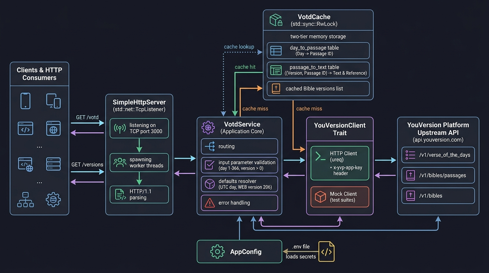

# Verse of the Day API — System Design & Architecture

This document explains how our Verse of the Day API is designed, how data flows through it, and how each component works together.

---

## Architectural Diagram

---

## Overview: What Does This System Do?

Our application sits between **end users** (people requesting a Bible verse) and the **YouVersion Platform API** (the service that holds all Bible texts).

When a user asks for today's verse:
1. We check our **local memory** first to see if we already fetched it earlier.
2. If we have it, we return it **instantly** (or very very fast).
3. If we don't have it, we fetch it from YouVersion, save it in our memory, and return it.

---

## Walkthrough of Each Component

### 1. Clients & Consumers (Left Side of Diagram)
* **Who they are:** Web browsers, mobile apps, or terminal tools (`curl`).
* **What they do:** Send standard HTTP requests to our server:
  * `GET /votd` — Asks for today's verse (or a specific day and Bible translation).
  * `GET /versions` — Asks for a list of available English Bible translations.

---

### 2. SimpleHttpServer (`src/server.rs`)
* **What it is:** The front door of our application. It listens for incoming network connections on port `3000`.
* **How it works:**
  * Whenever a client connects, the server gives that connection its own worker thread so multiple users can connect at the exact same time without waiting in line.

---

### 3. VotdService — The Application Core (`src/service.rs`)
* **What it is:** The "brain" of the application. It handles all required logic:
  * **Routing:** Checks the path of the request (`/votd`, `/versions`, or unknown).
  * **Input Checking:** Ensures the requested `day` is a valid number between `1` and `366`, and that the `version` is a positive number. If the user types something wrong (like `day=500` or `version=abc`), it immediately replies with a clear `400 Bad Request` error.
  * **Smart Defaults:** If the user doesn't specify a day, it calculates today's day of the year (UTC). If they don't specify a Bible version, it defaults to version `206` (World English Bible).
  * **Error Handling:** If YouVersion's API goes down or fails, it cleanly catches the issue and returns a `502 Bad Gateway` error without crashing.

---

### 4. VotdCache — In-Memory Storage (`src/cache.rs`)
* **What it is:** A high-speed memory storage box that remembers previous answers.
* **Why it's special:**
  * It uses a **Read-Write Lock (`RwLock`)**: Multiple users can read from memory at the exact same time without blocking each other. We only lock the memory for a short time when writing a newly fetched verse.
  * **Two-Tier Storage for Multiple Bible Versions:**
    1. **Day-to-Passage Table:** Remembers which verse belongs to which day (for example, Day 195 is always Revelation 3:20, regardless of translation).
    2. **Passage-to-Text Table:** Remembers the actual text for each translation (e.g. `(Version 206, Revelation 3:20)` vs `(Version 12, Revelation 3:20)`).
  * **Cross-Translation Efficiency:** If User A asks for Day 195 in the World English Bible, and User B asks for Day 195 in the American Standard Version, our system already knows it's Revelation 3:20 and skips that first network call!

---

### 5. YouVersionClient Trait — The Messenger (`src/client.rs`)
* **What it is:** An abstraction layer that defines how we talk to YouVersion.
* **Two Implementations:**
  1. **HTTP Client (`HttpYouVersionClient`):** Used when running the real server. Uses a lightweight, synchronous HTTP tool (`ureq`) to send requests to `api.youversion.com` with our secret API key and a 10-second safety timeout.
  2. **Mock Client (`MockYouVersionClient`):** Used during automated testing (`cargo test`). It simulates YouVersion locally with zero network calls, counting each time a method is called so our tests can mathematically prove that caching works.

#### How We Prove That Caching Works
To prove that our server truly caches responses—and doesn't make unnecessary duplicate calls to YouVersion—our automated tests use a simple 3-step counter proof:

1. **Step 1: The First Request (Cache Miss)**
   * A test asks our server for `day=195&version=206`.
   * Because memory is empty, the server must fetch data from the client.
   * The mock client registers the call and increments its internal counter from **`0` to `1`**.
   * The test verifies that the counter equals `1`.

2. **Step 2: The Second Request (The Cache Hit Proof)**
   * The test sends the exact same request (`day=195&version=206`) a second time.
   * If the cache works properly, our service retrieves the answer directly from memory and **never touches the client**.
   * The mock client's counter **stays at `1`**.
   * The test checks that the counter is still `1`. If our code had accidentally made a duplicate call, the counter would have become `2` and the test would immediately fail.

3. **Step 3: Cross-Translation Proof**
   * If the test then requests Day 195 with a *different* Bible version, our server reuses the passage ID already stored in memory (it knows Day 195 is Revelation 3:20) and **only** fetches the text for the new translation—making zero duplicate calls for the day.

---

### 6. YouVersion Platform API (Far Right)
* **What it is:** The upstream external service hosted at `https://api.youversion.com`.
* **Endpoints used:**
  * `GET /v1/verse_of_the_days/{day}` — Tells us which passage is assigned to a day.
  * `GET /v1/bibles/{version}/passages/{passage_id}` — Gives us the actual text of that verse.
  * `GET /v1/bibles` — Gives us the catalog of available Bible translations.

---

### 7. AppConfig & Security (`src/config.rs`)
* **What it is:** The configuration manager.
* **Keeping Secrets Safe:**
  * Reads the secret API key from an invisible, local `.env` file that is ignored by Git.
  * The API key is never committed to GitHub and is automatically masked (`[REDACTED]`) so it can never accidentally print to logs or error messages.

---

## The Journey of a Request

### Scenario A: First Time Asking (Cache Miss)
1. **Client** requests `GET /votd?day=195&version=206`.
2. **SimpleHttpServer** accepts the connection and hands it to **VotdService**.
3. **VotdService** validates that `195` is between 1 and 366, and `206` is positive.
4. **VotdCache** is checked --> Empty (Cache Miss).
5. **YouVersionClient** calls YouVersion --> Receives `REV.3.20` and its text.
6. **VotdCache** stores the result in memory.
7. **Client** receives the response.

### Scenario B: Second Time Asking (Cache Hit)
1. Another user requests `GET /votd?day=195&version=206`.
2. **VotdService** checks **VotdCache** --> Found! (Cache Hit).
3. **Client** receives the exact same response in a shorter time with **zero network calls to YouVersion**.
